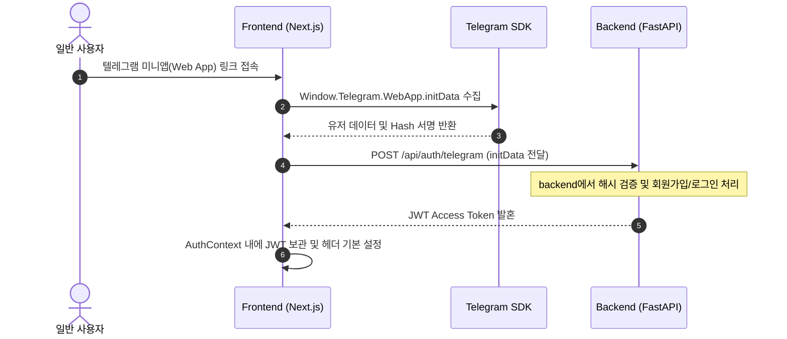

# External Reports Hub Frontend Flow

이 문서는 **External Reports Hub의 프론트엔드 애플리케이션(`ssh-reports-hub`)**의 렌더링 파이프라인 및 백엔드 API 연동 구조를 설명하여, 다른 LLM이 코드 전체를 분석하지 않고도 핵심 렌더링 흐름을 바로 이해하도록 돕습니다.

---

## 1. 프론트엔드 시스템 아키텍처 (Frontend Architecture)

본 프론트엔드는 일반 사용자들에게 증권사 리포트 피드를 실시간 제공하고, 맞춤형 키워드 알림 및 즐겨찾기(Favorites) 관리 기능을 구현하는 웹 레이어입니다.

```mermaid
flowchart TD
    %% 컴포넌트 레이어
    subgraph "React / Next.js Components"
        FeedPage["Report Feed Page\n(리포트 목록 및 무한 스크롤)"]
        DetailPage["Report Detail Modal\n(세 줄 요약 & PDF 뷰어)"]
        SettingPage["Keyword Alert View\n(알림 설정 페이지)"]
        FavoritePage["Favorites View\n(즐겨찾기 보관함)"]
    end

    %% 상태 관리 및 데이터 연동 레이어
    subgraph "API Fetching & State"
        AuthContext["Auth Provider\n(Telegram WebApp Login / JWT)"]
        QueryClient["React Query / SWR\n(API 데이터 캐싱 & 상태)"]
        ApiServices["API Fetching Services\n(Axios / Fetch)"]
    end

    %% 백엔드 및 외부 모듈
    subgraph "External Connections"
        BackendAPI["FastAPI Backend\n(/api/reports, /api/users)"]
        TelegramWebApp["Telegram WebApp SDK\n(유저 인증 획득)"]
    end

    %% 연결 관계
    TelegramWebApp -->|1. Init Data| AuthContext
    AuthContext -->|2. Get JWT Token| ApiServices
    
    FeedPage -->|Use Query| QueryClient
    SettingPage -->|Use Query| QueryClient
    FavoritePage -->|Use Query| QueryClient
    DetailPage -->|Render PDF / AI Summary| QueryClient

    QueryClient -->|Call Request| ApiServices
    ApiServices -->|HTTP Request with Bearer Token| BackendAPI
end
```

---

## 2. 주요 UI/UX 기능 렌더링 시퀀스 (Key UI Flow)

### 2.1 텔레그램 연동 로그인 및 인증 처리


### 2.2 메인 피드 조회 및 즐겨찾기 토글
* **무한 스크롤(Infinite Scroll)**: 사용자가 스크롤을 내릴 때마다 백엔드의 `/api/reports?page={next_page}`를 비동기적으로 호출하여 피드를 확장합니다.
* **즐겨찾기 토글**: 하트 버튼 클릭 시 `POST /api/reports/{id}/favorite`를 호출하여 즐겨찾기 상태를 DB와 동기화하고 로컬 UI 캐시를 즉시 갱신(Optimistic Update)합니다.

---

## 3. 백엔드 연동 API 엔드포인트 요약 (Frontend-to-Backend Endpoints)

| API 경로 | HTTP Method | 역할 | UI 영역 |
| :--- | :---: | :--- | :--- |
| `/api/auth/telegram` | `POST` | 텔레그램 WebApp 검증 및 JWT 발급 | 애플리케이션 진입 초기 |
| `/api/reports` | `GET` | 리포트 목록 조회 (필터: `firm_nm`, `reg_dt`, `search`) | 메인 피드 페이지 |
| `/api/reports/{id}` | `GET` | AI 요약 결과 및 아카이브 PDF URL 상세 조회 | 리포트 상세 모달 |
| `/api/reports/{id}/favorite` | `POST` / `DELETE` | 특정 리포트의 즐겨찾기 활성화 및 취소 | 피드 카드 / 상세 모달 |
| `/api/users/keywords` | `GET` / `POST` | 사용자의 맞춤형 알림 키워드 추가/삭제 | 설정 탭 |
